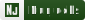
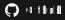

# Hi there, I'm David 👋

I'm David Moll, a frontend-engineer UI/UX and content-creator from  **Aachen, Germany** working for [xapling GmbH](https://xapling.de).

## Things I work with

### Languages

      

### Frameworks and libraries

        

### Operating System

  

### Tools

        

### Programs and websites

                 

## Open Source projects
<i>If any websites are offline then I am working on my server</i>
<table>
    <thead align="center">
    <tr>
        <td><b>Project</b></td>
        <td><b>Link</b></td>
        <td><b>Github Repo</b></td>
        <td><b>Technologies used</b></td>
    </tr>
    </thead>
    <tbody>
        <tr>
            <td>Flag Guesser</td>
            <td><a href="https://flags.davidmoll.net">Flag Guesser</a></td>
            <td><a href="https://github.com/akashic101/flagguesser">https://github.com/akashic101/flagguesser</a></td>
            <td>          </td>
        </tr>
        <tr>
            <td>Blog</td>
            <td><a href="https://blog.davidmoll.net">David Moll's blog</a></td>
            <td><a href="https://github.com/akashic101/blog">https://github.com/akashic101/blog</a></td>
            <td>         </td>
        </tr>
    </tbody>
</table>

## Other projects
<table>
    <thead align="center">
    <tr>
        <td><b>Project</b></td>
        <td><b>Link</b></td>
        <td><b>Technologies used</b></td>
        <td><b>What I did</b></td>
    </tr>
    </thead>
    <tbody>
        <tr>
            <td>ACC Drive (WIP)</td>
            <td><a href="https://www2.accdrive.de/">ACC Drive</a></td>
            <td>       </td>
            <td>Concept & Design, Frontend-development</td>
        </tr>
    </tbody>
</table>

## My latest posts

<table>
  <tr><th>Title</th><th>Link</th></tr>
  <!-- BLOG-POST-LIST:START --><!-- BLOG-POST-LIST:END -->
</table>
</ul>
